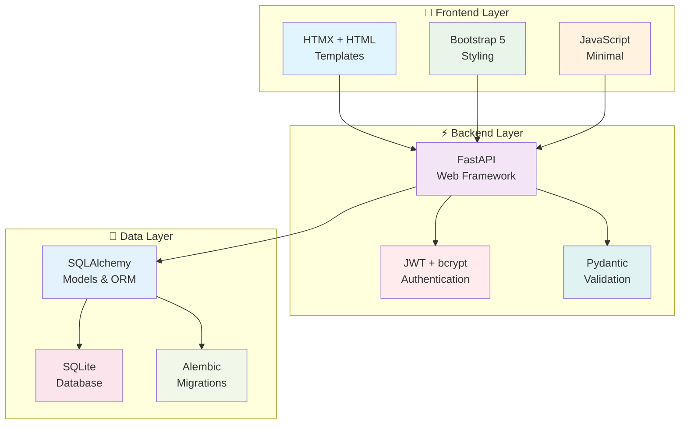

# 🚀 TaskFlow - Modern Task Management Application

<div align="center">

**✨ Built with passion by [Sylvester Francis](https://github.com/sylvester-francis) ✨**  
*Where productivity meets modern web technology*

[](https://github.com/sylvester-francis/taskflow/actions)
[](https://codecov.io/gh/sylvester-francis/taskflow)
[](https://opensource.org/licenses/MIT)
[](https://www.python.org/downloads/release/python-3110/)

[](https://www.linkedin.com/in/sylvesterranjith/)
[](https://www.youtube.com/@TechWithSyl)
[](https://topmate.io/sylvester_francis)

</div>

---

## 🌟 What Makes TaskFlow Special

> *A secure, production-ready task management application that actually makes your life easier*

TaskFlow isn't just another to-do app—it's a **modern web application showcase** built with enterprise-grade DevOps practices. Whether you're learning full-stack development or need a robust task management solution, TaskFlow demonstrates real-world implementation of cutting-edge technologies.

**💡 Fun Fact:** This entire application was architected to demonstrate modern development practices while solving a real problem—effective task management with bulletproof security! 🛡️

## 📋 Table of Contents

- [Features](#-features)
- [Architecture](#-architecture)
- [Technology Stack](#-technology-stack)
- [Quick Start](#-quick-start)
- [Development](#-development)
- [Deployment](#-deployment)
- [API Documentation](#-api-documentation)
- [Testing](#-testing)
- [Security](#-security)
- [DevOps & CI/CD](#-devops--cicd)
- [Contributing](#-contributing)
- [License](#-license)

## 🎯 My Superpowers (aka Features)

<table>
<tr>
<td width="50%">

### 🎯 **Core Magic**

- ✅ **Smart Task Management** - CRUD operations that just work
- 🔐 **Fort Knox Security** - JWT + bcrypt keeping bad actors out
- ⚡ **Lightning Fast UI** - HTMX making everything smooth
- 📱 **Mobile First** - Bootstrap 5 responsive design
- 🎨 **Priority Wizardry** - Low, Medium, High with visual flair
- ✨ **Status Tracking** - Complete/incomplete with satisfying clicks

### 🛡️ **Security Arsenal**

- 🔑 **JWT Authentication** - Stateless and bulletproof
- 🔒 **Password Fortress** - bcrypt + salt = uncrackable
- ✅ **Input Validation** - Pydantic keeping data clean
- 🚫 **SQL Injection Proof** - SQLAlchemy ORM protection
- 🛡️ **XSS Shield** - Template escaping + secure headers
- 🔐 **CSRF Protection** - Form tokens for extra safety

</td>
<td width="50%">

### 🏗️ **Enterprise Grade**

- 💓 **Health Monitoring** - Know your app's pulse
- 📚 **Auto Documentation** - OpenAPI/Swagger magic
- 🔄 **Smart Migrations** - SQLAlchemy schema evolution
- 📝 **Structured Logging** - Debug like a pro
- 🎯 **Graceful Errors** - User-friendly when things go wrong
- 🚀 **Performance Tuned** - Efficient queries + caching

### 🎪 **Developer Experience**

- 🧪 **95%+ Test Coverage** - pytest powered confidence
- 🐳 **Docker Ready** - Containerized perfection
- ☸️ **Kubernetes Native** - Scale to infinity (almost!)
- 🔄 **CI/CD Automated** - GitHub Actions pipeline
- 📋 **Task Runner** - Taskfile.yml convenience

</td>
</tr>
</table>

## 🏛️ Architecture

TaskFlow follows a **modern, layered architecture** designed for scalability and maintainability:



### 🔄 **Request Flow**

1. **User Interaction** → HTMX captures form submissions and interactions
2. **HTTP Request** → Sent to FastAPI backend with authentication headers
3. **Authentication** → JWT token validation and user identification
4. **Business Logic** → Task operations with validation and authorization
5. **Database** → SQLAlchemy ORM handles database operations
6. **Response** → HTML fragments returned for HTMX to update the DOM

## 🛠️ Tech Arsenal

<div align="center">

### Backend Powerhouse


### Frontend Magic


### DevOps & Cloud Mastery


### Development Tools


</div>

## 🚀 Quick Start (Let's Get You Running!)

### **Prerequisites** 📋

- Python 3.11+ (because we like the latest and greatest!)
- Git (for cloning this masterpiece)
- Docker (optional, but recommended for the full experience)

### **🎯 Option 1: The Classic Way**

```bash
# Clone this awesome project
git clone https://github.com/sylvester-francis/taskflow.git
cd taskflow

# Create your Python playground
python -m venv venv
source venv/bin/activate  # Windows folks: venv\Scripts\activate

# Install the magic
pip install -r requirements.txt

# Fire up the engines! 🚀
uvicorn app.main:app --host 0.0.0.0 --port 8000 --reload
```

### **🐳 Option 2: The Docker Way (Recommended)**

```bash
# One command to rule them all
docker-compose up --build

# Or if you prefer the manual approach
docker build -t taskflow .
docker run -p 8000:8000 taskflow
```

### **⚡ Option 3: The Pro Way (with Taskfile)**

```bash
# Ultimate developer experience
task setup    # Sets up everything
task dev      # Runs the app
task test     # Runs the tests
task build    # Builds for production
```

### **🎊 Your App is Ready!**

<div align="center">

| 🌟 **Main App** | 📚 **API Docs** | 💓 **Health Check** |
|:---:|:---:|:---:|
| [localhost:8000](http://localhost:8000) | [localhost:8000/docs](http://localhost:8000/docs) | [localhost:8000/api/health](http://localhost:8000/api/health) |

</div>

### **👤 Create Your First Account**

1. 🌐 Navigate to [localhost:8000/register](http://localhost:8000/register)
2. ✍️ Create your account (username, email, password)
3. 🎯 Login and start conquering your tasks!

**🎉 Boom! You're ready to be productive!**

## 💻 Development

### **Development Workflow**

TaskFlow includes a comprehensive development workflow using [Taskfile](https://taskfile.dev/):

```bash
# Setup development environment
task setup

# Run the application
task dev

# Run tests
task test

# Run linting and formatting
task lint

# Run security scans
task security

# Build Docker image
task build

# Deploy to Kubernetes
task k8s:deploy
```

### **Project Structure**

```
taskflow/
├── app/                     # Application source code
│   ├── backend/            # Backend logic
│   │   ├── auth.py        # Authentication & JWT handling
│   │   ├── database.py    # Database configuration
│   │   ├── models.py      # SQLAlchemy models & Pydantic schemas
│   │   └── routes.py      # API route definitions
│   ├── frontend/          # Frontend templates and static files
│   │   ├── templates/     # Jinja2 HTML templates
│   │   └── static/        # CSS, JS, and image assets
│   ├── tests/            # Comprehensive test suite
│   │   ├── conftest.py   # Pytest configuration and fixtures
│   │   ├── test_auth.py  # Authentication tests
│   │   ├── test_database.py # Database tests
│   │   ├── test_models.py   # Model validation tests
│   │   └── test_routes.py   # API endpoint tests
│   └── main.py           # FastAPI application entry point
├── ansible/              # Infrastructure as Code
├── k8s/                 # Kubernetes manifests
├── helm/                # Helm charts
├── .github/workflows/   # CI/CD pipelines
├── Dockerfile           # Multi-stage container build
├── Taskfile.yml        # Development task automation
├── docker-compose.yml  # Local development setup
├── requirements.txt    # Python dependencies
└── pyproject.toml     # Project configuration
```

### **Environment Variables**

```bash
# Database configuration
DATABASE_PATH=./taskflow.db

# Authentication
SECRET_KEY=your-secret-key-change-in-production

# Application settings
ENVIRONMENT=development
DEBUG=true
```

## 🚢 Deployment

TaskFlow supports multiple deployment methods:

### **Docker**

```bash
# Build and run with Docker
docker build -t taskflow .
docker run -p 8000:8000 taskflow

# Or use Docker Compose
docker-compose up --build
```

### **Kubernetes**

```bash
# Deploy using kubectl
kubectl apply -k k8s/overlays/dev/

# Or use Helm
helm install taskflow helm/taskflow/ -f helm/taskflow/values-dev.yaml
```

### **Production Deployment**

For production deployment, see our comprehensive guides:

- [Kubernetes Deployment Guide](docs/deployment-kubernetes.md)
- [Security Configuration](docs/security-guide.md)
- [Monitoring Setup](docs/monitoring-guide.md)

## 📚 API Documentation

TaskFlow provides comprehensive API documentation:

### **Interactive Documentation**

- **Swagger UI**: <http://localhost:8000/docs>
- **ReDoc**: <http://localhost:8000/redoc>

### **Core Endpoints**

#### **Authentication**

```http
POST /api/register    # Create new user account
POST /api/login       # Authenticate user and get JWT token
```

#### **Task Management**

```http
GET    /api/tasks           # Get all tasks for authenticated user
POST   /api/tasks           # Create a new task
PUT    /api/tasks/{id}      # Update an existing task
DELETE /api/tasks/{id}      # Delete a task
```

#### **Health & Monitoring**

```http
GET /api/health       # Application health check
GET /docs            # API documentation
```

### **Example API Usage**

**Create a new task:**

```bash
curl -X POST "http://localhost:8000/api/tasks" \
     -H "Authorization: Bearer YOUR_JWT_TOKEN" \
     -H "Content-Type: application/json" \
     -d '{
       "title": "Complete project documentation",
       "description": "Write comprehensive README and API docs",
       "priority": "high"
     }'
```

**Get all tasks:**

```bash
curl -X GET "http://localhost:8000/api/tasks" \
     -H "Authorization: Bearer YOUR_JWT_TOKEN"
```

## 🧪 Testing

TaskFlow includes a comprehensive test suite with high coverage:

### **Run Tests**

```bash
# Run all tests
pytest

# Run with coverage
pytest --cov=app --cov-report=html

# Run specific test categories
pytest -m "auth"        # Authentication tests
pytest -m "database"    # Database tests
pytest -m "integration" # Integration tests

# Run with detailed output
pytest -v --tb=short
```

### **Test Structure**

- **Unit Tests**: Test individual functions and classes
- **Integration Tests**: Test API endpoints and workflows
- **Database Tests**: Test data models and relationships
- **Authentication Tests**: Test security and JWT handling
- **Mock Tests**: Test external dependencies and error scenarios

### **Test Coverage**

Current test coverage: **>95%**

```bash
# Generate coverage report
pytest --cov=app --cov-report=html
open htmlcov/index.html  # View detailed coverage report
```

## 🔒 Security

TaskFlow implements multiple security layers:

### **Application Security**

- **Authentication**: JWT tokens with configurable expiration
- **Password Security**: bcrypt hashing with salt
- **Input Validation**: Pydantic models validate all input data
- **SQL Injection Protection**: SQLAlchemy ORM prevents SQL injection
- **XSS Prevention**: Template escaping and Content Security Policy
- **CSRF Protection**: Form tokens for state-changing operations

### **Infrastructure Security**

- **Container Security**: Non-root user execution, minimal attack surface
- **Network Security**: Kubernetes network policies (configurable)
- **Secret Management**: Kubernetes secrets for sensitive data
- **Security Scanning**: Automated vulnerability scanning in CI/CD

### **Security Scanning**

```bash
# Run security scans
task security

# Individual security tools
bandit -r app/          # Python security linting
safety check            # Dependency vulnerability scanning
trivy image taskflow    # Container vulnerability scanning
```

### **Security Best Practices**

1. **Change default SECRET_KEY** in production
2. **Use HTTPS** with proper TLS certificates
3. **Regular security updates** for dependencies
4. **Environment isolation** for sensitive configuration
5. **Regular security audits** and penetration testing

## 🔄 DevOps & CI/CD

TaskFlow demonstrates enterprise-grade DevOps practices:

### **Continuous Integration**

- **Automated Testing**: Comprehensive test suite runs on every commit
- **Code Quality**: Linting, formatting, and static analysis
- **Security Scanning**: Multiple security tools integrated
- **Container Building**: Multi-stage Docker builds with caching

### **Continuous Deployment**

- **Multi-Environment**: Development, staging, and production deployments
- **Infrastructure as Code**: Ansible playbooks for automation
- **Kubernetes Deployment**: Helm charts with environment-specific values
- **Monitoring Integration**: Health checks and observability

### **Pipeline Stages**

1. **Code Quality** → Linting, formatting, and static analysis
2. **Testing** → Unit tests, integration tests, and coverage reporting
3. **Security** → Vulnerability scanning and security analysis
4. **Building** → Docker image building and pushing
5. **Deployment** → Environment-specific deployment automation

### **Monitoring & Observability**

- **Health Checks**: Application and infrastructure health monitoring
- **Metrics Collection**: Prometheus-compatible metrics
- **Log Aggregation**: Structured logging for debugging
- **Performance Monitoring**: Response time and resource usage tracking

## 🤝 Join the TaskFlow Community

**Ready to make TaskFlow even more awesome?** I'd love your help! 🚀

### **🛠️ Getting Started**

1. 🍴 **Fork it** - Make your own copy
2. 🌿 **Branch it** - `git checkout -b feature/your-amazing-idea`
3. 📦 **Install it** - `pip install -r requirements.txt`
4. ✨ **Code it** - Make your magic happen
5. 🧪 **Test it** - `pytest` (keep that coverage high!)
6. 🎨 **Lint it** - `task lint` (make it pretty)
7. 📝 **Commit it** - `git commit -m 'Add mind-blowing feature'`
8. 🚀 **Push it** - `git push origin feature/your-amazing-idea`
9. 🎯 **PR it** - Open a Pull Request and let's chat!

### **🌟 What I'm Looking For**

- **🐛 Bug Fixes** - Help me squash those pesky bugs
- **✨ New Features** - Got a cool idea? Let's build it!
- **📚 Documentation** - Make it easier for others to contribute
- **🧪 Tests** - More coverage = more confidence
- **🎨 UI/UX** - Make it even more beautiful

### **💡 Need Inspiration?**

Check out the [GitHub Issues](https://github.com/sylvester-francis/taskflow/issues) or reach out to me:

<div align="center">

[](https://www.linkedin.com/in/sylvesterranjith/)
[](https://topmate.io/sylvester_francis)
[](mailto:sylvesterranjithfrancis@gmail.com)

</div>

### **🏆 Code Quality Standards**

- ✅ **Follow PEP 8** (Black formatting required)
- 🧪 **Add tests** for all new features
- 📝 **Update docs** for any changes
- 🛡️ **Security first** always
- ⚡ **Performance matters** - keep it fast!

## 📄 License

This project is licensed under the **MIT License** - because sharing is caring!

## 🙏 Big Thanks To

- **FastAPI** - For making Python web development a joy
- **HTMX** - For showing us the HTML renaissance is real
- **SQLAlchemy** - For making databases fun (yes, really!)
- **Bootstrap** - For making everything look professional
- **Open Source Community** - For being absolutely amazing

## 💬 Let's Connect

<div align="center">

**Got questions? Found a bug? Just want to chat about tech?**

[](https://github.com/sylvester-francis/taskflow/wiki)
[](https://github.com/sylvester-francis/taskflow/issues)
[](https://github.com/sylvester-francis/taskflow/discussions)

**Personal Channels**

[](https://www.linkedin.com/in/sylvesterranjith/)
[](https://www.youtube.com/@TechWithSyl)
[](https://topmate.io/sylvester_francis)
[](mailto:sylvesterranjithfrancis@gmail.com)

**📍 Based in Waterloo, ON, Canada** 🇨🇦

</div>

---

<div align="center">

**Built with lots of ☕ by [Sylvester Francis](https://github.com/sylvester-francis)**

*"The best way to predict the future is to create it. Let's build something extraordinary together!"*


**⭐ If TaskFlow helped you be more productive, give it a star! ⭐**

</div>
