# TaskFlow - Modern Task Management Application

[](https://github.com/sylvester-francis/taskflow/actions)
[](https://codecov.io/gh/sylvester-francis/taskflow)
[](https://opensource.org/licenses/MIT)
[](https://www.python.org/downloads/release/python-3110/)

A secure, production-ready task management application built with modern web technologies and enterprise-grade DevOps practices. TaskFlow demonstrates full-stack development patterns, containerization, Kubernetes deployment, and comprehensive CI/CD automation.

**Author:** [Sylvester Francis](https://github.com/sylvester-francis) | [LinkedIn](https://www.linkedin.com/in/sylvesterranjith/) | [YouTube](https://www.youtube.com/@TechWithSyl)

## Overview

TaskFlow is a modern web application that showcases contemporary development practices while providing a practical task management solution. Built with security, scalability, and maintainability in mind, it serves as both a functional application and a reference implementation for modern web development.

## 📋 Table of Contents

- [Features](#-features)
- [Architecture](#-architecture)
- [Technology Stack](#-technology-stack)
- [Quick Start](#-quick-start)
- [Development](#-development)
- [Deployment](#-deployment)
- [API Documentation](#-api-documentation)
- [Testing](#-testing)
- [Security](#-security)
- [DevOps & CI/CD](#-devops--cicd)
- [Contributing](#-contributing)
- [License](#-license)

## Features

### Core Functionality

- **Task Management**: Complete CRUD operations for tasks with priority levels
- **User Authentication**: Secure JWT-based authentication with bcrypt password hashing
- **Real-time UI**: Dynamic updates using HTMX without page refreshes
- **Responsive Design**: Mobile-friendly interface built with Bootstrap 5
- **Task Priorities**: Low, Medium, High priority classification
- **Status Tracking**: Mark tasks as completed/incomplete

### Security

- **JWT Authentication**: Stateless, secure token-based authentication
- **Password Security**: bcrypt hashing with salt for password storage
- **Input Validation**: Comprehensive validation using Pydantic models
- **SQL Injection Protection**: SQLAlchemy ORM prevents SQL injection attacks
- **XSS Protection**: Template escaping and secure headers
- **CSRF Protection**: Form token validation for state-changing operations

### Enterprise Features

- **Health Checks**: Built-in health monitoring endpoints
- **API Documentation**: Auto-generated OpenAPI/Swagger documentation
- **Database Migrations**: SQLAlchemy-based schema management
- **Structured Logging**: Comprehensive logging for debugging and monitoring
- **Error Handling**: Graceful error handling with user-friendly messages
- **Performance Optimization**: Efficient queries and caching strategies

### Development

- **95%+ Test Coverage**: Comprehensive test suite with pytest
- **Docker Support**: Full containerization with multi-stage builds
- **Kubernetes Ready**: Production-ready Kubernetes manifests
- **CI/CD Pipeline**: Automated testing, building, and deployment
- **Development Tools**: Taskfile for streamlined development workflow

## Architecture

TaskFlow follows a **modern, layered architecture** designed for scalability and maintainability:

```mermaid
graph TB
    subgraph "🎨 Frontend Layer"
        A[HTMX + HTML<br/>Templates] 
        B[Bootstrap 5<br/>Styling]
        C[JavaScript<br/>Minimal]
    end
    
    subgraph "⚡ Backend Layer"
        D[FastAPI<br/>Web Framework]
        E[JWT + bcrypt<br/>Authentication]
        F[Pydantic<br/>Validation]
    end
    
    subgraph "💾 Data Layer"
        G[SQLite<br/>Database]
        H[SQLAlchemy<br/>Models & ORM]
        I[Alembic<br/>Migrations]
    end
    
    A --> D
    B --> D
    C --> D
    D --> E
    D --> F
    D --> H
    H --> G
    H --> I
    
    style A fill:#e1f5fe
    style B fill:#e8f5e8
    style C fill:#fff3e0
    style D fill:#f3e5f5
    style E fill:#ffebee
    style F fill:#e0f2f1
    style G fill:#fce4ec
    style H fill:#e3f2fd
    style I fill:#f1f8e9
```



### 🔄 **Request Flow**

```mermaid
sequenceDiagram
    participant User as 👤 User
    participant Frontend as 🎨 HTMX Frontend
    participant FastAPI as ⚡ FastAPI Backend
    participant Auth as 🔐 JWT Auth
    participant DB as 💾 SQLite DB
    
    User->>Frontend: 1. Interact with form/button
    Frontend->>FastAPI: 2. HTTP Request + JWT Token
    FastAPI->>Auth: 3. Validate JWT Token
    Auth-->>FastAPI: 4. User Identity Confirmed
    FastAPI->>FastAPI: 5. Business Logic & Validation
    FastAPI->>DB: 6. Database Operations (CRUD)
    DB-->>FastAPI: 7. Data Response
    FastAPI-->>Frontend: 8. HTML Fragment Response
    Frontend->>User: 9. DOM Update (No Page Refresh!)
    
    Note over User,DB: 🚀 Lightning fast, secure, and smooth!
```



## Technology Stack

### Backend

- **FastAPI** - Modern, fast Python web framework
- **SQLAlchemy** - Python SQL toolkit and ORM
- **SQLite** - Lightweight, serverless database
- **Pydantic** - Data validation using Python type hints
- **python-jose** - JWT token handling
- **passlib** - Password hashing with bcrypt

### Frontend

- **HTMX** - Modern HTML-over-the-wire approach
- **Bootstrap 5** - CSS framework for responsive design
- **Jinja2** - Template engine for server-side rendering

### DevOps & Infrastructure

- **Docker** - Containerization with multi-stage builds
- **Kubernetes** - Container orchestration and deployment
- **Helm** - Kubernetes package manager
- **GitHub Actions** - CI/CD automation
- **Ansible** - Infrastructure as Code automation

### Development Tools

- **pytest** - Testing framework with fixtures and mocking
- **Black** - Code formatting
- **isort** - Import sorting
- **flake8** - Linting
- **Taskfile** - Task runner for development workflows

## Quick Start

### Prerequisites

- Python 3.11 or higher
- Git
- Docker (optional, for containerized development)

### Option 1: Local Development

```bash
# Clone the repository
git clone https://github.com/sylvester-francis/taskflow.git
cd taskflow

# Create virtual environment
python -m venv venv
source venv/bin/activate  # On Windows: venv\Scripts\activate

# Install dependencies
pip install -r requirements.txt

# Start the development server
uvicorn app.main:app --host 0.0.0.0 --port 8000 --reload
```

### Option 2: Docker

```bash
# Using Docker Compose
docker-compose up --build

# Or build and run manually
docker build -t taskflow .
docker run -p 8000:8000 taskflow
```

### Option 3: Using Taskfile

```bash
# Setup development environment
task setup

# Run the application
task dev

# Run tests
task test

# Build for production
task build
```

### Access the Application

- **Main Application**: <http://localhost:8000>
- **API Documentation**: <http://localhost:8000/docs>
- **Health Check**: <http://localhost:8000/api/health>

### Getting Started

1. Navigate to <http://localhost:8000/register>
2. Create a new account with username, email, and password
3. Login and start managing your tasks

## 💻 Development

### **Development Workflow**

TaskFlow includes a comprehensive development workflow using [Taskfile](https://taskfile.dev/):

```bash
# Setup development environment
task setup

# Run the application
task dev

# Run tests
task test

# Run linting and formatting
task lint

# Run security scans
task security

# Build Docker image
task build

# Deploy to Kubernetes
task k8s:deploy
```

### Project Structure

```
taskflow/
├── app/                          # Application source code
│   ├── backend/                 # Backend logic
│   │   ├── auth.py             # Authentication & JWT handling
│   │   ├── database.py         # Database configuration
│   │   ├── models.py           # SQLAlchemy models & Pydantic schemas
│   │   └── routes.py           # API route definitions
│   ├── frontend/               # Frontend templates and static files
│   │   ├── templates/          # Jinja2 HTML templates
│   │   │   ├── base.html       # Base template
│   │   │   ├── dashboard.html  # Main dashboard
│   │   │   ├── login.html      # Login page
│   │   │   ├── register.html   # Registration page
│   │   │   └── partials/       # HTMX partial templates
│   │   └── static/             # CSS, JS, and image assets
│   │       └── style.css       # Application styles
│   ├── tests/                  # Comprehensive test suite (95%+ coverage)
│   │   ├── conftest.py         # Pytest configuration and fixtures
│   │   ├── test_auth.py        # Authentication tests
│   │   ├── test_database.py    # Database tests
│   │   ├── test_models.py      # Model validation tests
│   │   ├── test_routes.py      # API endpoint tests
│   │   └── test_main.py        # Main application tests
│   └── main.py                 # FastAPI application entry point
├── ansible/                     # Infrastructure as Code automation
│   ├── playbooks/              # Ansible playbooks
│   ├── library/                # Custom Ansible modules
│   ├── group_vars/             # Environment-specific variables
│   └── inventory/              # Host inventory
├── k8s/                        # Kubernetes manifests
│   ├── base/                   # Base Kubernetes resources
│   ├── overlays/               # Environment-specific overlays
│   │   ├── dev/               # Development environment
│   │   └── prod/              # Production environment
│   └── monitoring/            # Monitoring stack (Prometheus/Grafana)
├── helm/                       # Helm charts
│   └── taskflow/              # TaskFlow Helm chart
│       ├── templates/         # Kubernetes template files
│       ├── values.yaml        # Default values
│       ├── values-dev.yaml    # Development values
│       └── values-prod.yaml   # Production values
├── docs/                       # Documentation
├── scripts/                    # Utility scripts
├── .github/workflows/          # CI/CD pipelines
├── Dockerfile                  # Multi-stage container build
├── Taskfile.yml               # Development task automation
├── docker-compose.yml         # Local development setup
├── requirements.txt           # Python dependencies
├── pyproject.toml            # Project configuration
└── README.md                 # Project documentation
```

### **Environment Variables**

```bash
# Database configuration
DATABASE_PATH=./taskflow.db

# Authentication
SECRET_KEY=your-secret-key-change-in-production

# Application settings
ENVIRONMENT=development
DEBUG=true
```

## 🚢 Deployment

TaskFlow supports multiple deployment methods:

### **Docker**

```bash
# Build and run with Docker
docker build -t taskflow .
docker run -p 8000:8000 taskflow

# Or use Docker Compose
docker-compose up --build
```

### **Kubernetes**

```bash
# Deploy using kubectl
kubectl apply -k k8s/overlays/dev/

# Or use Helm
helm install taskflow helm/taskflow/ -f helm/taskflow/values-dev.yaml
```

### **Production Deployment**

For production deployment, see our comprehensive guides:

- [Kubernetes Deployment Guide](docs/deployment-kubernetes.md)
- [Security Configuration](docs/security-guide.md)
- [Monitoring Setup](docs/monitoring-guide.md)

## 📚 API Documentation

TaskFlow provides comprehensive API documentation:

### **Interactive Documentation**

- **Swagger UI**: <http://localhost:8000/docs>
- **ReDoc**: <http://localhost:8000/redoc>

### **Core Endpoints**

#### **Authentication**

```http
POST /api/register    # Create new user account
POST /api/login       # Authenticate user and get JWT token
```

#### **Task Management**

```http
GET    /api/tasks           # Get all tasks for authenticated user
POST   /api/tasks           # Create a new task
PUT    /api/tasks/{id}      # Update an existing task
DELETE /api/tasks/{id}      # Delete a task
```

#### **Health & Monitoring**

```http
GET /api/health       # Application health check
GET /docs            # API documentation
```

### **Example API Usage**

**Create a new task:**

```bash
curl -X POST "http://localhost:8000/api/tasks" \
     -H "Authorization: Bearer YOUR_JWT_TOKEN" \
     -H "Content-Type: application/json" \
     -d '{
       "title": "Complete project documentation",
       "description": "Write comprehensive README and API docs",
       "priority": "high"
     }'
```

**Get all tasks:**

```bash
curl -X GET "http://localhost:8000/api/tasks" \
     -H "Authorization: Bearer YOUR_JWT_TOKEN"
```

## 🧪 Testing

TaskFlow includes a comprehensive test suite with high coverage:

### **Run Tests**

```bash
# Run all tests
pytest

# Run with coverage
pytest --cov=app --cov-report=html

# Run specific test categories
pytest -m "auth"        # Authentication tests
pytest -m "database"    # Database tests
pytest -m "integration" # Integration tests

# Run with detailed output
pytest -v --tb=short
```

### **Test Structure**

- **Unit Tests**: Test individual functions and classes
- **Integration Tests**: Test API endpoints and workflows
- **Database Tests**: Test data models and relationships
- **Authentication Tests**: Test security and JWT handling
- **Mock Tests**: Test external dependencies and error scenarios

### **Test Coverage**

Current test coverage: **>95%**

```bash
# Generate coverage report
pytest --cov=app --cov-report=html
open htmlcov/index.html  # View detailed coverage report
```

## 🔒 Security

TaskFlow implements multiple security layers:

### **Application Security**

- **Authentication**: JWT tokens with configurable expiration
- **Password Security**: bcrypt hashing with salt
- **Input Validation**: Pydantic models validate all input data
- **SQL Injection Protection**: SQLAlchemy ORM prevents SQL injection
- **XSS Prevention**: Template escaping and Content Security Policy
- **CSRF Protection**: Form tokens for state-changing operations

### **Infrastructure Security**

- **Container Security**: Non-root user execution, minimal attack surface
- **Network Security**: Kubernetes network policies (configurable)
- **Secret Management**: Kubernetes secrets for sensitive data
- **Security Scanning**: Automated vulnerability scanning in CI/CD

### **Security Scanning**

```bash
# Run security scans
task security

# Individual security tools
bandit -r app/          # Python security linting
safety check            # Dependency vulnerability scanning
trivy image taskflow    # Container vulnerability scanning
```

### **Security Best Practices**

1. **Change default SECRET_KEY** in production
2. **Use HTTPS** with proper TLS certificates
3. **Regular security updates** for dependencies
4. **Environment isolation** for sensitive configuration
5. **Regular security audits** and penetration testing

## 🔄 DevOps & CI/CD

TaskFlow demonstrates enterprise-grade DevOps practices:

### **Continuous Integration**

- **Automated Testing**: Comprehensive test suite runs on every commit
- **Code Quality**: Linting, formatting, and static analysis
- **Security Scanning**: Multiple security tools integrated
- **Container Building**: Multi-stage Docker builds with caching

### **Continuous Deployment**

- **Multi-Environment**: Development, staging, and production deployments
- **Infrastructure as Code**: Ansible playbooks for automation
- **Kubernetes Deployment**: Helm charts with environment-specific values
- **Monitoring Integration**: Health checks and observability

### **Pipeline Stages**

1. **Code Quality** → Linting, formatting, and static analysis
2. **Testing** → Unit tests, integration tests, and coverage reporting
3. **Security** → Vulnerability scanning and security analysis
4. **Building** → Docker image building and pushing
5. **Deployment** → Environment-specific deployment automation

### **Monitoring & Observability**

- **Health Checks**: Application and infrastructure health monitoring
- **Metrics Collection**: Prometheus-compatible metrics
- **Log Aggregation**: Structured logging for debugging
- **Performance Monitoring**: Response time and resource usage tracking

## Contributing

Contributions are welcome! Here's how to get started:

### Development Setup

1. Fork the repository
2. Create a feature branch: `git checkout -b feature/your-feature-name`
3. Install development dependencies: `pip install -r requirements.txt`
4. Make your changes and add tests
5. Run the test suite: `pytest`
6. Run linting: `task lint`
7. Commit your changes: `git commit -m 'Add some feature'`
8. Push to your branch: `git push origin feature/your-feature-name`
9. Open a Pull Request

### Contribution Guidelines

- **Code Quality**: Follow PEP 8 and use Black for formatting
- **Testing**: Add tests for all new functionality
- **Documentation**: Update documentation for new features
- **Security**: Follow security best practices
- **Performance**: Consider performance impact of changes

For questions or suggestions, feel free to:

- Open an issue on [GitHub](https://github.com/sylvester-francis/taskflow/issues)
- Connect on [LinkedIn](https://www.linkedin.com/in/sylvesterranjith/)
- Email: <sylvesterranjithfrancis@gmail.com>

## License

This project is licensed under the MIT License - see the [LICENSE](LICENSE) file for details.

## Acknowledgments

- **FastAPI** for the excellent web framework
- **HTMX** for modern frontend development approach
- **SQLAlchemy** for robust database management
- **Bootstrap** for responsive design components
- **Open Source Community** for inspiration and tools

## Support

- **Documentation**: [Project Wiki](https://github.com/sylvester-francis/taskflow/wiki)
- **Issues**: [GitHub Issues](https://github.com/sylvester-francis/taskflow/issues)
- **Discussions**: [GitHub Discussions](https://github.com/sylvester-francis/taskflow/discussions)

---

**Built by [Sylvester Francis](https://github.com/sylvester-francis)** | [LinkedIn](https://www.linkedin.com/in/sylvesterranjith/) | [YouTube](https://www.youtube.com/@TechWithSyl)
