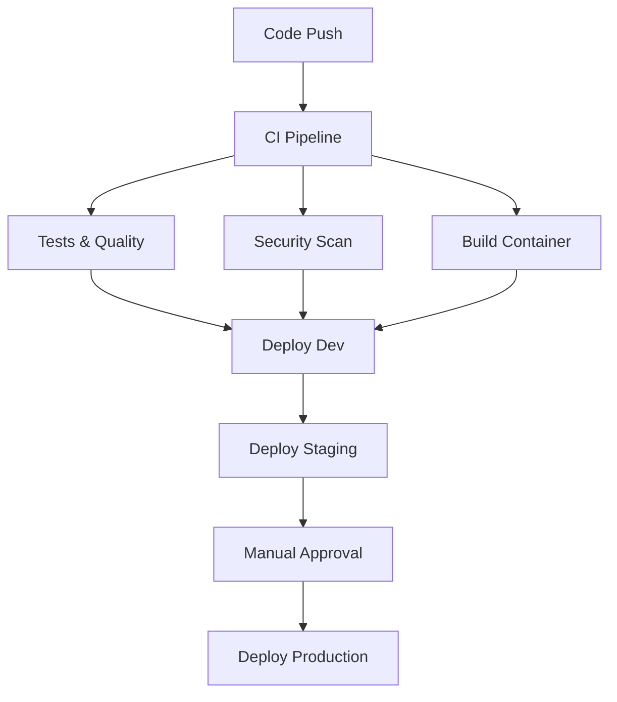

# CI/CD Pipeline Documentation

## Overview

TaskFlow uses GitHub Actions for a comprehensive CI/CD pipeline that includes testing, security scanning, building, and multi-environment deployment.

## Pipeline Architecture



## Workflows

### 1. Main CI/CD Pipeline (`ci-cd.yml`)

**Triggers:**
- Push to `main` or `develop` branches
- Pull requests to `main`
- Release publication

**Jobs:**
1. **Test & Code Quality**: Linting, formatting, testing, coverage
2. **Build & Scan**: Docker build, container security scan
3. **Helm Validate**: Chart validation and packaging
4. **Deploy Dev**: Automatic deployment to development (develop branch)
5. **Deploy Staging**: Automatic deployment to staging (main branch)
6. **Deploy Production**: Manual deployment on release

### 2. Pull Request Validation (`pr-validation.yml`)

**Triggers:**
- Pull request opened/updated

**Features:**
- Code quality checks
- Test execution
- Security analysis
- Docker build validation
- Helm chart validation
- Breaking change detection
- Automated PR comments with results

### 3. Security Scanning (`security.yml`)

**Triggers:**
- Weekly schedule (Mondays 2 AM)
- Push to main
- Pull requests

**Security Tools:**
- **Bandit**: Python security linter
- **Safety**: Dependency vulnerability scanner
- **Semgrep**: Multi-language static analysis
- **Trivy**: Container vulnerability scanner
- **TruffleHog**: Secrets detection
- **OWASP Dependency Check**: Known vulnerability database

### 4. Release Automation (`release.yml`)

**Triggers:**
- Git tag creation (`v*.*.*`)

**Features:**
- Automatic changelog generation
- Multi-platform container builds
- SBOM (Software Bill of Materials) generation
- Helm chart packaging and publishing
- Production deployment
- Slack notifications

### 5. CodeQL Analysis (`codeql.yml`)

**Triggers:**
- Push to main/develop
- Pull requests
- Weekly schedule

**Languages:**
- Python
- JavaScript

## Environment Configuration

### Development Environment
- **Trigger**: Push to `develop` branch
- **Namespace**: `taskflow-dev`
- **Resources**: Minimal (1 replica, 50m CPU, 64Mi RAM)
- **Auto-deploy**: Yes
- **URL**: `https://taskflow-dev.example.com`

### Staging Environment
- **Trigger**: Push to `main` branch
- **Namespace**: `taskflow-staging`
- **Resources**: Moderate (2 replicas, 100m CPU, 128Mi RAM)
- **Auto-deploy**: Yes
- **URL**: `https://taskflow-staging.example.com`

### Production Environment
- **Trigger**: Release creation
- **Namespace**: `taskflow`
- **Resources**: Full (3 replicas, 200m CPU, 256Mi RAM, HPA enabled)
- **Auto-deploy**: Manual approval required
- **URL**: `https://taskflow.example.com`

## Required Secrets

Configure the following secrets in your GitHub repository:

### Container Registry
- `GITHUB_TOKEN`: Automatically provided by GitHub

### Kubernetes Access
- `KUBECONFIG_DEV`: Base64-encoded kubeconfig for development cluster
- `KUBECONFIG_STAGING`: Base64-encoded kubeconfig for staging cluster
- `KUBECONFIG_PROD`: Base64-encoded kubeconfig for production cluster

### Notifications
- `SLACK_WEBHOOK`: Slack webhook URL for deployment notifications

## Quality Gates

### Code Quality
- **Black**: Code formatting (88 character line length)
- **isort**: Import sorting
- **flake8**: Linting with extended ignore list
- **mypy**: Type checking (warnings allowed)

### Testing
- **pytest**: Unit tests with coverage
- **Coverage**: Minimum 80% coverage required
- **Integration**: Smoke tests on deployment

### Security
- **Bandit**: Python security linting
- **Safety**: Dependency vulnerability scanning
- **Trivy**: Container image scanning
- **Secrets**: No hardcoded secrets detection

## Local Development

### Run CI Checks Locally
```bash
# All CI checks
make ci-test

# Individual checks
make format              # Fix formatting
black app/              # Format code
isort app/              # Sort imports
flake8 app/             # Lint code
pytest app/tests/       # Run tests
bandit -r app/          # Security scan
safety check            # Dependency scan
```

### Validate CI/CD Configuration
```bash
make ci-validate
```

## Branch Strategy

```
main ──────────────────► Production
  ↑
develop ────────────────► Development
  ↑
feature/xxx ───────────► Pull Request
```

### Workflow:
1. Create feature branch from `develop`
2. Open PR to `develop` → Triggers validation
3. Merge to `develop` → Deploys to development
4. PR from `develop` to `main` → Triggers validation
5. Merge to `main` → Deploys to staging
6. Create release tag → Deploys to production

## Deployment Process

### Automatic Deployments
1. **Development**: Every push to `develop`
2. **Staging**: Every push to `main`

### Production Deployment
1. Create a release tag: `git tag v1.0.0 && git push origin v1.0.0`
2. GitHub automatically creates a release
3. CI/CD pipeline builds and tests
4. Manual approval required in GitHub UI
5. Deployment proceeds to production
6. Slack notification sent

### Rollback Process
```bash
# Helm rollback
helm rollback taskflow <revision> --namespace taskflow

# Check rollback status
kubectl rollout status deployment/taskflow --namespace taskflow
```

## Monitoring & Alerts

### Build Status
- GitHub Actions status badges
- Email notifications for failed builds
- Slack notifications for deployments

### Security Alerts
- Dependabot for dependency updates
- Security scan results in PR comments
- CodeQL analysis for code vulnerabilities

### Deployment Health
- Kubernetes health checks
- Post-deployment verification
- Application monitoring (planned)

## Troubleshooting

### Common Issues

#### 1. Test Failures
```bash
# Run tests locally
cd app && python -m pytest tests/ -v

# Check coverage
cd app && python -m pytest tests/ --cov=. --cov-report=html
```

#### 2. Container Build Failures
```bash
# Test Docker build locally
docker build -t taskflow:test .

# Check for security issues
trivy image taskflow:test
```

#### 3. Deployment Failures
```bash
# Check Kubernetes events
kubectl get events --namespace taskflow --sort-by='.lastTimestamp'

# Check pod logs
kubectl logs -l app.kubernetes.io/name=taskflow --namespace taskflow
```

#### 4. Helm Issues
```bash
# Validate chart
helm lint helm/taskflow/

# Test template rendering
helm template test helm/taskflow/ --values helm/taskflow/values-dev.yaml
```

## Best Practices

### Code Quality
- Run `make ci-test` before pushing
- Use conventional commit messages
- Keep PRs small and focused
- Add tests for new functionality

### Security
- Never commit secrets or credentials
- Regularly update dependencies
- Review security scan results
- Use least-privilege access

### Deployment
- Test in development first
- Verify staging deployment
- Plan production deployments
- Have rollback plan ready

## Pipeline Metrics

Track the following metrics:
- Build success rate
- Deployment frequency
- Lead time for changes
- Mean time to recovery
- Test coverage percentage
- Security scan results